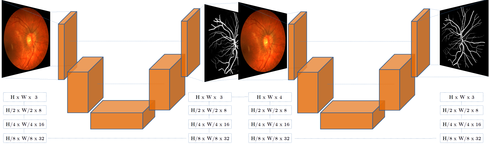

# LwNet Extensions for Retinal Vessel Segmentation

This is an independent fork of [agaldran/lwnet](https://github.com/agaldran/lwnet). The original author's walkthrough comes first below; My optional extensions follow it. Original claims, pretrained weights, and reported scores belong to Adrian Galdran and the original LwNet authors, not to this fork.

## Original Work

Please cite **The Little W-Net That Could: State-of-the-Art Retinal Vessel Segmentation with Minimalistic Models**, Adrian Galdran, Andre Anjos, Jose Dolz, Hadi Chakor, Herve Lombaert, and Ismail Ben Ayed, [arXiv:2009.01907](https://arxiv.org/abs/2009.01907). The upstream repository is [agaldran/lwnet](https://github.com/agaldran/lwnet).

## Contents

1. [Installation and Data](#installation-and-data)
2. [Original LwNet Walkthrough](#original-lwnet-walkthrough)
3. [Fork Extensions](#fork-extensions)
4. [Compatibility and Caveats](#compatibility-and-caveats)

## Installation and Data

Use Python 3.10 or another version with wheels for the selected PyTorch release. Install a matching CPU or CUDA build of `torch` and `torchvision` using the [official PyTorch selector](https://pytorch.org/get-started/locally/), then install the remaining direct dependencies:

```bash
pip install torch torchvision
pip install -r requirements.txt
```

`environment.txt` is a historical Linux `@EXPLICIT` Conda export for Python 3.7 and CUDA 10.0. It is not a portable pip requirements file. Dataset preparation may additionally require `wget`, `unzip`, `tar`, or other platform tools.

The original broad downloader is:

```bash
python get_public_data_smart.py
```

It populates `data/` with public datasets. The LES-AV download now requires a manual step described in `get_public_data.py`. Windows users should inspect `get_public_data_windows.py` and `get_public_data_smart.py` before running a downloader. A prepared dataset normally contains `images`, `mask`, `manual`, and `test_all.csv`. Training datasets also contain `train.csv`, `val.csv`, and `test.csv`; A/V datasets may contain `manual_av`, `test_all_av.csv`, and the corresponding `*_av.csv` splits. DRIVE may include `ZoneB_manual`; HRF training may include resized image, mask, and manual directories.

## Original LwNet Walkthrough

The original model is a two-stage W-Net: U-Net 1 predicts an intermediate vessel representation and U-Net 2 refines it. The default `wnet` architecture remains the original Little U-Net second stage.

### Train Vessel Models

Training defaults to CPU and requires a save path. `--cycle_lens C/E` means `C` cycles of `E` epochs. These commands reproduce the original training layouts, subject to the original data, hardware, and preprocessing:

```bash
python train_cyclical.py --csv_train data/DRIVE/train.csv --cycle_lens 20/50 --model_name wnet --save_path wnet_drive --device cuda:0
python train_cyclical.py --csv_train data/CHASEDB/train.csv --cycle_lens 40/50 --model_name wnet --save_path wnet_chasedb --device cuda:0
python train_cyclical.py --csv_train data/HRF/train.csv --cycle_lens 30/50 --model_name wnet --save_path wnet_hrf_1024 --im_size 1024 --batch_size 2 --grad_acc_steps 1 --device cuda:0
```

The resulting experiment directories are normally `experiments/wnet_drive`, `experiments/wnet_chasedb`, and `experiments/wnet_hrf_1024`. The original schedule uses batch size 4; HRF uses 1024x1024 images and gradient accumulation for a single GPU.

### Generate Vessel Segmentations

```bash
python generate_results.py --config_file experiments/wnet_drive/config.cfg --dataset DRIVE --device cuda:0
python generate_results.py --config_file experiments/wnet_chasedb/config.cfg --dataset CHASEDB --device cuda:0
python generate_results.py --config_file experiments/wnet_hrf_1024/config.cfg --dataset HRF --im_size 1024 --device cuda:0
```

Predictions are written below `results/<dataset>/experiments/<experiment>`, unless `--result_path` changes the root.

### Compute Performance

The evaluation uses training predictions to select a threshold and test predictions for the reported metrics. Keep the dataset CSV splits unchanged when comparing runs:

```bash
python analyze_results.py --path_train_preds results/DRIVE/experiments/wnet_drive --path_test_preds results/DRIVE/experiments/wnet_drive --train_dataset DRIVE --test_dataset DRIVE
python analyze_results.py --path_train_preds results/CHASEDB/experiments/wnet_chasedb --path_test_preds results/CHASEDB/experiments/wnet_chasedb --train_dataset CHASEDB --test_dataset CHASEDB
python analyze_results.py --path_train_preds results/HRF/experiments/wnet_hrf_1024 --path_test_preds results/HRF/experiments/wnet_hrf_1024 --train_dataset HRF --test_dataset HRF
```

### Cross-Dataset Evaluation

Generate predictions on both the training source dataset and the target dataset, then pass the source predictions as `--path_train_preds`:

```bash
python generate_results.py --config_file experiments/wnet_drive/config.cfg --dataset DRIVE --device cuda:0
python generate_results.py --config_file experiments/wnet_drive/config.cfg --dataset CHASEDB --device cuda:0
python analyze_results.py --path_train_preds results/DRIVE/experiments/wnet_drive --path_test_preds results/CHASEDB/experiments/wnet_drive --train_dataset DRIVE --test_dataset CHASEDB
```

### Pseudo-Label Training

First train a source model and generate target predictions:

```bash
python train_cyclical.py --csv_train data/DRIVE/train.csv --cycle_lens 20/50 --model_name wnet --save_path wnet_drive --device cuda:0
python generate_results.py --config_file experiments/wnet_drive/config.cfg --dataset CHASEDB --device cuda:0
```

Then train using source labels plus target pseudo-labels. `--checkpoint_folder` initializes weights; it is not a general optimizer/training-state resume:

```bash
python train_cyclical.py --save_path wnet_drive_chasedb_pl --checkpoint_folder experiments/wnet_drive --csv_test data/CHASEDB/test_all.csv --path_test_preds results/CHASEDB/experiments/wnet_drive --max_lr 0.0001 --cycle_lens 10/1 --metric tr_auc --device cuda:0
python generate_results.py --config_file experiments/wnet_drive_chasedb_pl/config.cfg --dataset DRIVE --device cuda:0
python generate_results.py --config_file experiments/wnet_drive_chasedb_pl/config.cfg --dataset CHASEDB --device cuda:0
python analyze_results.py --path_train_preds results/DRIVE/experiments/wnet_drive --path_test_preds results/CHASEDB/experiments/wnet_drive_chasedb_pl --train_dataset DRIVE --test_dataset CHASEDB
```

### Evaluate Your Own Model

Place probabilistic PNG predictions in separate training and test directories. Filenames must match the retinal image names. Use the training predictions to calibrate the threshold:

```bash
python analyze_results.py --path_train_preds train_preds --path_test_preds test_preds --train_dataset dataset_A --test_dataset dataset_B
```

Use the same train/test split CSVs as the dataset definition; otherwise the evaluation can accidentally include training images.

### Artery/Vein Training

The original A/V workflow uses the larger `big_wnet` model. The current CLI option is `--cycle_lens` (plural):

```bash
python train_cyclical.py --csv_train data/DRIVE/train_av.csv --model_name big_wnet --cycle_lens 40/50 --do_not_save False --save_path big_wnet_drive_av --device cuda:0
python train_cyclical.py --csv_train data/HRF/train_av.csv --model_name big_wnet --cycle_lens 40/50 --do_not_save False --save_path big_wnet_hrf_av_1024 --im_size 1024 --batch_size 2 --grad_acc_steps 1 --device cuda:0
```

### Artery/Vein Inference

```bash
python generate_av_results.py --config_file experiments/big_wnet_drive_av/config.cfg --dataset DRIVE --device cuda:0
python generate_av_results.py --config_file experiments/big_wnet_drive_av/config.cfg --dataset LES_AV --device cuda:0
python generate_av_results.py --config_file experiments/big_wnet_hrf_av_1024/config.cfg --dataset HRF --im_size 1024 --device cuda:0
```

LES_AV is unavailable until its manual dataset preparation is completed.

### One-Image Prediction

For vessel prediction, provide a model directory, input image, and result directory. The FOV mask is optional:

```bash
python predict_one_image.py --model_path experiments/wnet_drive --im_path folder/my_image.jpg --result_path my_results --mask_path folder/my_mask.jpg --device cuda:0 --bin_thresh 0.42
python predict_one_image.py --model_path experiments/wnet_hrf_1024 --im_path folder/my_image.jpg --result_path my_results --device cuda:0 --im_size 1024 --bin_thresh 0.3725
```

For A/V prediction:

```bash
python predict_one_image_av.py --model_path experiments/big_wnet_drive_av --im_path folder/my_image.jpg --result_path my_results
python predict_one_image_av.py --model_path experiments/big_wnet_hrf_av_1024 --im_path folder/my_image.jpg --result_path my_results --im_size 1024
```

The A/V script uses an argmax rather than a vessel binarization threshold. The original pretrained files and their performance are not evidence of new fork results.

## Fork Extensions

The following options are implemented in this checkout and are documented separately from the original walkthrough. They are optional experiments, not validated improvements. Every observed statement below is qualitative because no controlled numerical comparison is claimed here.

### Checkpoint Selection

Checkpoint checks run at cycle boundaries by default. `0` retains cycle-only checks; `1` starts epoch-level checks in the first cycle. Ordered metrics support near-tie policies:

```bash
python train_cyclical.py --csv_train data/DRIVE/train.csv --cycle_lens 2/2 --model_name wnet --save_path wnet_drive_checkpoint --metric auc,dice,loss --epoch_checkpointing_from 1 --metric_tolerances auc=0.0005,dice=0.0001,loss=0.000001 --device cpu
```

Expected effect: more frequent or multi-metric selection can choose a different checkpoint than cycle-only AUC selection. Observed outcome: selection metadata records the chosen policy and diagnostics; no fork-specific score improvement is asserted.

### FreeSDG, FMAug, and RAFFE Modes

FreeSDG frequency augmentation is opt-in and preserves the baseline path when omitted. The mode choices are `fmaug`, `fixed_hfc`, `random_hfc`, `raffe_filter`, and `raffe_smooth_mix`:

```bash
python train_cyclical.py --csv_train data/DRIVE/train.csv --cycle_lens 2/2 --model_name wnet --freesdg --freesdg_aug_mode fmaug --freesdg_test_input raw --save_path wnet_drive_freesdg --device cpu --seed 0
python train_cyclical.py --csv_train data/DRIVE/train.csv --cycle_lens 2/2 --model_name wnet --freesdg --freesdg_aug_mode raffe_smooth_mix --freesdg_test_input raw --save_path wnet_drive_raffe --device cpu --seed 0
```

Expected effect: frequency-domain views change the training input distribution while keeping paired masks aligned. Observed outcome: these modes are available and covered by smoke tests; no controlled performance claim is made.

### Loss Compositions

The loss is `w_bce*BCE + w_dice*Dice + w_cldice*clDice + w_boundary*boundary`. Weights are independent and default to the original BCE behavior:

```bash
python train_cyclical.py --csv_train data/DRIVE/train.csv --cycle_lens 2/2 --model_name wnet --loss_bce_weight 1.0 --loss_dice_weight 0.5 --loss_cldice_weight 0.1 --loss_boundary_weight 0.0 --save_path wnet_drive_losses --device cpu
```

Expected effect: Dice and topology terms emphasize foreground overlap and connectivity; the boundary term is resolution-dependent. Observed outcome: component values and weighted contributions are reported during training; no numerical improvement is claimed.

### Auxiliary Structural Saliency

This is an auxiliary reconstruction task inspired by RaffeSDG. It uses the geometrically aligned original RGB image to build a Gaussian high-frequency target and branches from U-Net 1. It is not the full RaffeSDG attention-coupling architecture, and it does not add a second segmentation view:

```bash
python train_cyclical.py --csv_train data/DRIVE/train.csv --cycle_lens 2/2 --model_name wnet --structural_saliency --structural_saliency_weight 1.0 --structural_saliency_kernel 27 --structural_saliency_sigma 9.0 --structural_saliency_ratio 4.0 --save_path wnet_drive_saliency --device cpu
```

Expected effect: the auxiliary target adds a reconstruction objective during training only. Observed outcome: the saliency decoder is saved and reconstructed from `config.cfg`; inference still returns U-Net 2 vessel logits only.

### Gated Cross-Stage Bridges

Bridges reuse selected U-Net 1 decoder features in U-Net 2 through learned residual gates. Gates start at zero, so the initial forward path matches the original W-Net:

```bash
python train_cyclical.py --csv_train data/DRIVE/train.csv --cycle_lens 2/2 --model_name wnet --cross_stage_bridge scalar --cross_stage_bridge_scales all --cross_stage_bridge_init 0.0 --epoch_checkpointing_from 1 --metric auc,dice,loss --save_path wnet_drive_bridge --device cpu --seed 0
```

Expected effect: training can learn multi-scale feature reuse between stages. Observed outcome: scalar and channel bridge variants instantiate and round-trip through checkpoints; FR-U2 and FR-U2-Lite are incompatible with these bridges and must use `--cross_stage_bridge none`.

### FR-U2 and FR-U2-Lite

These alternatives replace only the second-stage Little U-Net. FR-U2 is a full-resolution multi-resolution model; Lite uses fixed 4/8/16 channel widths and a shorter interaction schedule:

```bash
python train_cyclical.py --csv_train data/DRIVE/train.csv --cycle_lens 2/2 --model_name wnet --u2_arch fr_multi --fr_u2_base_channels 8 --fr_u2_dilations 1,2,4,2,1 --cross_stage_bridge none --save_path wnet_drive_fr --device cpu
python train_cyclical.py --csv_train data/DRIVE/train.csv --cycle_lens 2/2 --model_name wnet --fr_lite --cross_stage_bridge none --save_path wnet_drive_fr_lite --device cpu
```

Expected effect: FR-U2 variants change capacity and full-resolution feature interaction, while Lite reduces width and depth. Observed outcome: both architectures instantiate and recover their settings from `config.cfg`; no fork-specific segmentation gain is claimed.

### Damped Cosine Scheduler

This checkout retains the original `CosineAnnealingLR` scheduler. It has no `utils/schedulers.py` and no `--scheduler damped_cosine` CLI option, so no damped-cosine command is available on this branch. Do not combine scheduler flags with the FreeSDG examples above. If the separate `damped_cosine` branch is checked out, consult that branch's `--help` before using its scheduler-specific command.

The separate scheduler work describes a full cosine oscillation with an envelope: `alpha > 0` damps peaks, `alpha = 0` removes damping but is not the original cosine scheduler, and `-1 < alpha < 0` inflates peaks subject to an optional cap. The default cosine behavior in this branch is unchanged.

## Compatibility and Caveats

- `save_path` writes `config.cfg` and checkpoint files into the selected experiment directory. Reusing a directory can overwrite prior outputs; use a new directory for each run.
- The original evaluation protocol depends on dataset CSV splits, preprocessing, and threshold calibration. Do not compare different protocols as if they were equivalent.
- `--checkpoint_folder` loads model weights for pseudo-label training but does not resume optimizer, scheduler, or arbitrary training state.
- FreeSDG, saliency, loss, bridge, and FR-U2 options preserve original defaults when omitted.
- LES_AV and some public-data steps require manual downloads or external command-line tools.
- No fork-specific numerical result is claimed here without a traceable, controlled experiment table.
